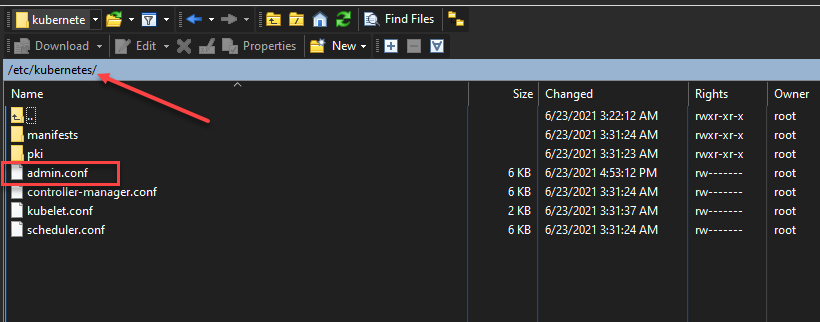

# Kubectl Setup in Windows

To install kubectl on Windows and create the kubeconfig file, it will generally involve the following steps:

1. Create a folder to contain your Kubernetes tools
2. Add the folder location to the Windows PATH environment variable
3. Download the kubectl command
4. Create the .kube directory
5. Create the Windows kubectl kubeconfig file
6. Change the API version listed in the kubeconfig file
7. Verify connectivity to the Kubernetes cluster

### 1. Create a folder to contain your Kubernetes tools <a href="#h-1-create-a-folder-to-contain-your-kubernetes-tools" id="h-1-create-a-folder-to-contain-your-kubernetes-tools"></a>

I like to create a folder that will house the tools used for Kubernetes. Many of these tools are self-contained executables that you can run from any directory. Examples include kubectl and helm. I like to create a directory called “KubeTools” which house all the tools I use for interacting with Kubernetes. This way, you just add one folder to your Windows PATH variable and you are good to go for any Kubernetes tool you place in the folder.

.png>)

### 2. Add the folder location to the Windows PATH environment variable <a href="#h-2-add-the-folder-location-to-the-windows-path-environment-variable" id="h-2-add-the-folder-location-to-the-windows-path-environment-variable"></a>

After you have created the folder, add the folder to the [Windows ](https://www.virtualizationhowto.com/2021/06/install-docker-on-windows-subsystem-for-linux-wsl-2-windows-10/)PATH environment variable. This makes it so you don’t have to navigate to the literal path of kubectl to run the command. You can simply type in the kubectl command from any command line context.

[**\*\*\*As a note\*\*\***](https://kubernetes.io/docs/tasks/tools/install-kubectl-windows/) **** Docker Desktop for Windows adds its own version of kubectl to the Windows PATH. If you have installed Docker Desktop, you may need to place your PATH entry before the one added by the Docker Desktop installer or remove the Docker Desktop’s kubectl.

.png>)

### 3. Download the kubectl command <a href="#h-3-download-the-kubectl-command" id="h-3-download-the-kubectl-command"></a>

After you have the folder in place and the directory in the PATH statement, you can download the kubectl command to your directory. To do you that, you run the CURL command below. Yes curl works in Windows 10.

```
curl -LO https://dl.k8s.io/release/v1.21.0/bin/windows/amd64/kubectl.exe
```


After you have configured the PATH statement and downloaded the kubectl command, run the kubectl command to verify you see the return from the command with the available parameters. This verifies the PATH statement is working as expected.


### 4. Create the .kube directory <a href="#h-4-create-the-kube-directory" id="h-4-create-the-kube-directory"></a>

Now that we have the kubectl utility downloaded and the Windows PATH statement in place to run the command from any command-line context, we need to create the directory the command looks to for the configuration. Kubectl looks at the path:\


```
$HOME/.kube
```

For Windows, this is the root of your %USERPROFILE% directory of the user that will be running the kubectl command. All you need to do is create the “.kube” directory in this directory.


### 5. Create the Windows kubectl kubeconfig file <a href="#h-5-create-the-windows-kubectl-kubeconfig-file" id="h-5-create-the-windows-kubectl-kubeconfig-file"></a>

Since the .kube directory is created, we now need to create the kubeconfig file that is needed for the kubectl command. The kubeconfig file contains the configuration needed to tell kubectl how to connect to the Kubernetes cluster. An easy way to “create” this file is simply copy the file that is generated on your [Kubernetes ](https://www.virtualizationhowto.com/2019/10/learning-kubernetes-with-vmware-kubernetes-academy-online/)hosts using the kubeadm command.



.png>)

### 6. Change the API version listed in the kubeconfig file <a href="#h-6-change-the-api-version-listed-in-the-kubeconfig-file" id="h-6-change-the-api-version-listed-in-the-kubeconfig-file"></a>

One little issue I ran into after copying down the kubeconfig file to the %userprofile%/.kube directory was the API version listed in the file errored out. Below is the error received.


In looking at the kubeconfig file, it was indeed set to **apiVersion: v0**. I simply changed this to **v1** and it resolved the issue.


### 7. Verify connectivity to the Kubernetes cluster <a href="#h-7-verify-connectivity-to-the-kubernetes-cluster" id="h-7-verify-connectivity-to-the-kubernetes-cluster"></a>

The last step is verifying connectivity to the Kubernetes cluster. After changing the API version in the kubeconfig file to v1, as you can see below, after getting the error we can now connect to the Kubernetes cluster and get pods.


